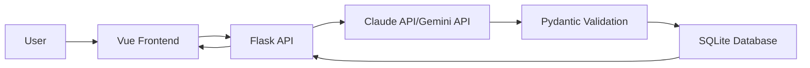
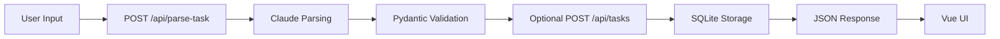

# AI Task Manager Agent

An AI-powered full-stack task manager that turns messy natural-language notes into validated structured tasks. The project uses a Vue frontend for task input and dashboard views, a Flask API for orchestration, Claude for language understanding, Pydantic for strict validation, and SQLite for persistence.

## Project Overview

This app is designed for the common workflow where a user has rough, unstructured text like:

`Finish pitch deck by next Tuesday, email finance, and renew car insurance this month`

The backend sends that text to Claude, forces a JSON-shaped response, validates the result with strict Pydantic schemas, and then stores clean tasks in SQLite. The frontend keeps the experience intentionally minimal: parse, review, save, and manage tasks.

## Features

- AI-powered task parsing via Anthropic Claude/Google Gemini
- Strict schema validation using Pydantic
- Flask REST API for parsing and CRUD operations
- SQLAlchemy + SQLite persistence
- Vue + Vite frontend with Axios-based API integration
- Bulk save flow for parsed tasks
- Clean error handling for invalid JSON, validation failures, and Claude API issues

## Tech Stack

### Backend

- Python
- Flask
- Pydantic
- SQLAlchemy
- SQLite
- Anthropic Claude API/Gemini API
- python-dotenv
- Flask-CORS

### Frontend

- Vue 3
- Vite
- Axios

## Project Structure

```text
root/
├── backend/
│   ├── app.py
│   ├── database/
│   ├── models/
│   ├── routes/
│   ├── schemas/
│   ├── services/
│   ├── utils/
│   ├── .env.example
│   └── requirements.txt
├── frontend/
│   ├── src/
│   ├── index.html
│   ├── package.json
│   └── vite.config.js
└── README.md
```

## Architecture Diagrams

### System Architecture



### Request Flow



## Backend Setup

1. Create and activate a Python virtual environment:

```bash
cd backend
python -m venv .venv
source .venv/bin/activate
```

2. Install dependencies:

```bash
pip install -r requirements.txt
```

3. Configure environment variables:

```bash
cp .env.example .env
```

4. Update `.env` with your Anthropic API key:

```env
ANTHROPIC_API_KEY=your_anthropic_api_key_here
ANTHROPIC_MODEL=claude-3-5-sonnet-latest
CLAUDE_MAX_RETRIES=3
```

5. Start the Flask server:

```bash
python app.py
```

The backend runs on [http://localhost:5001](http://localhost:5001).

## Frontend Setup

1. Install frontend dependencies:

```bash
cd frontend
npm install
```

2. Start the Vite development server:

```bash
npm run dev
```

The frontend runs on [http://localhost:5173](http://localhost:5173).

## Environment Variables

The backend uses these environment variables:

- `ANTHROPIC_API_KEY`: Required. Your Claude API key.
- `ANTHROPIC_MODEL`: Optional. Defaults to `claude-3-5-sonnet-latest`.
- `CLAUDE_MAX_RETRIES`: Optional. Defaults to `3`.

## API Documentation

### `POST /api/parse-task`

Parses messy natural-language input into validated structured tasks.

Request body:

```json
{
  "text": "Finish report by 2026-04-10 and schedule dentist visit"
}
```

Success response:

```json
{
  "tasks": [
    {
      "title": "Finish report",
      "description": null,
      "deadline": "2026-04-10",
      "priority": "medium",
      "category": "work",
      "status": "pending"
    }
  ]
}
```

Possible errors:

- `400`: Request validation failed
- `502`: Claude failed, returned invalid JSON, or produced an invalid schema
- `500`: Unexpected server error

### `POST /api/tasks`

Creates one task or a batch of tasks.

Single-task request:

```json
{
  "title": "Finish report",
  "description": "Prepare monthly summary",
  "deadline": "2026-04-10",
  "priority": "high",
  "category": "work",
  "status": "pending",
  "raw_input": "finish report by Apr 10"
}
```

Batch request:

```json
{
  "tasks": [
    {
      "title": "Finish report",
      "description": null,
      "deadline": "2026-04-10",
      "priority": "high",
      "category": "work",
      "status": "pending"
    }
  ]
}
```

### `GET /api/tasks`

Returns all saved tasks in reverse creation order.

### `PUT /api/tasks/<id>`

Updates a task by ID. Any subset of supported fields may be sent.

### `DELETE /api/tasks/<id>`

Deletes a task by ID.

## Frontend Explanation

The frontend is intentionally minimal and uses three main components:

- `TaskInput.vue`: Collects messy user input and calls `POST /api/parse-task`
- `ParsedTasks.vue`: Shows the structured task list and lets the user save all parsed tasks
- `TaskList.vue`: Loads saved tasks from the backend and allows task deletion

All API access is centralized in [`frontend/src/services/api.js`](/Users/asmitkumar/Desktop/Ai task manager/frontend/src/services/api.js).

## AI + Pydantic Pipeline

1. The user enters unstructured natural language in the Vue UI.
2. The frontend sends the raw text to `POST /api/parse-task`.
3. The Flask service calls Claude with a strict JSON-only instruction.
4. The backend extracts and parses the returned JSON.
5. Each returned task is validated through `ParsedTaskSchema`.
6. Only validated tasks are shown in the UI and allowed into storage.
7. The user saves approved tasks into SQLite through the CRUD API.

This keeps Pydantic central to the architecture: Claude generates candidate data, but Pydantic decides what is valid.

## Error Handling Strategy

The backend handles failure in distinct layers:

- Invalid request payloads are rejected by Pydantic with `400` responses.
- Claude API transport or authentication failures return `502`.
- Claude responses with malformed JSON trigger a retry loop before failing.
- Claude JSON that does not match the schema is retried and then rejected.
- Database and unexpected server failures return `500`.

The frontend surfaces backend error messages directly where relevant so users can understand whether the issue happened during parsing, saving, loading, or deletion.

## Running the Full App

Open two terminals.

Backend:

```bash
cd backend
source .venv/bin/activate
python app.py
```

Frontend:

```bash
cd frontend
npm run dev
```

Then open [http://localhost:5173](http://localhost:5173).
